# DevOps 07 CI2

## Lernjournal

Als erstes habe ich den Shell-Befehle für Sonar Analyse ins CMD eingeben damit das Project auf Sonar verfügbar ist und analysiert wird. (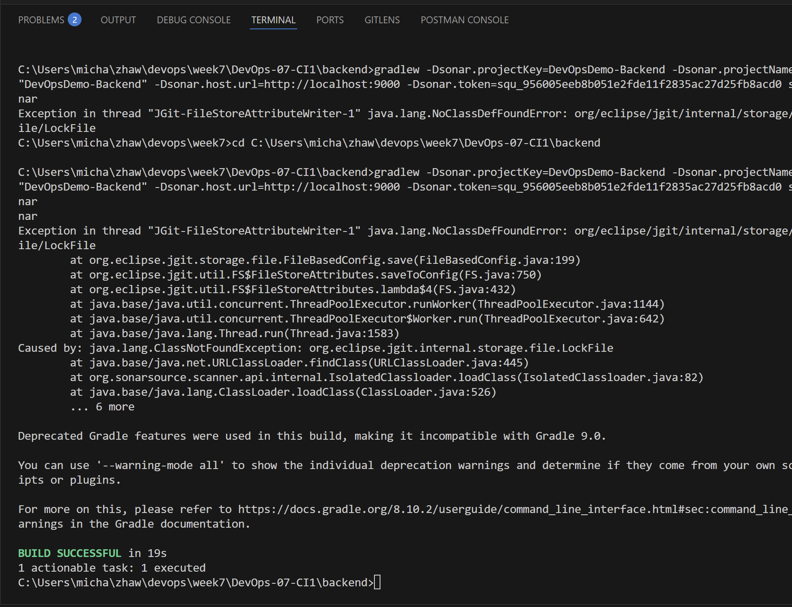) (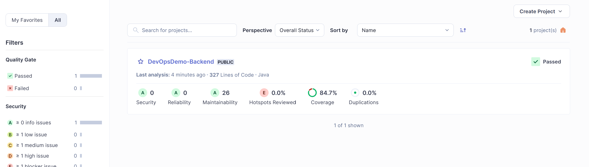)

Das gleiche fürs Frontend: (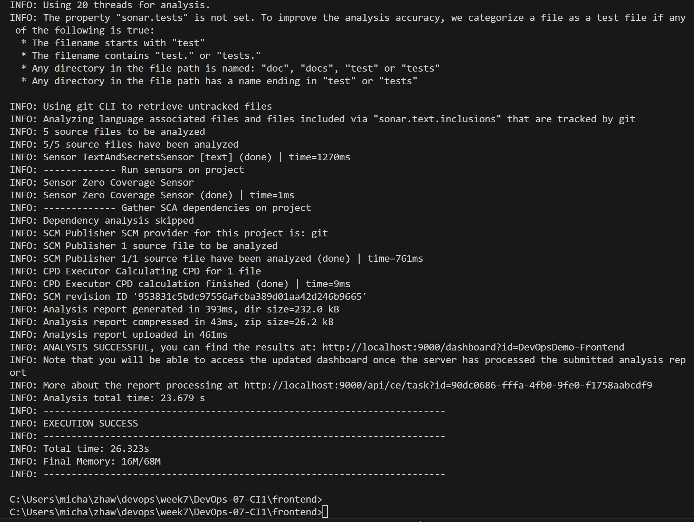) (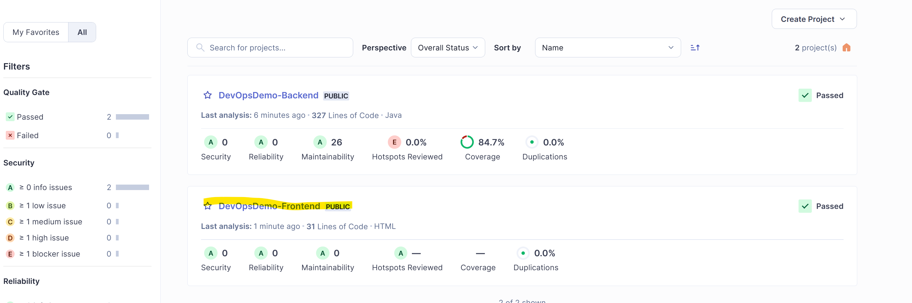)

Als nächstes habe ich auf Jenkins eine Pipeline angelegt: (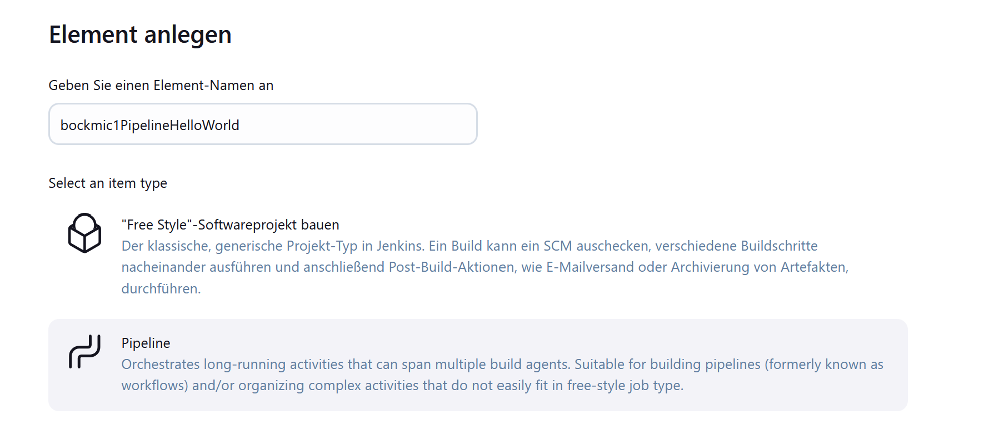) (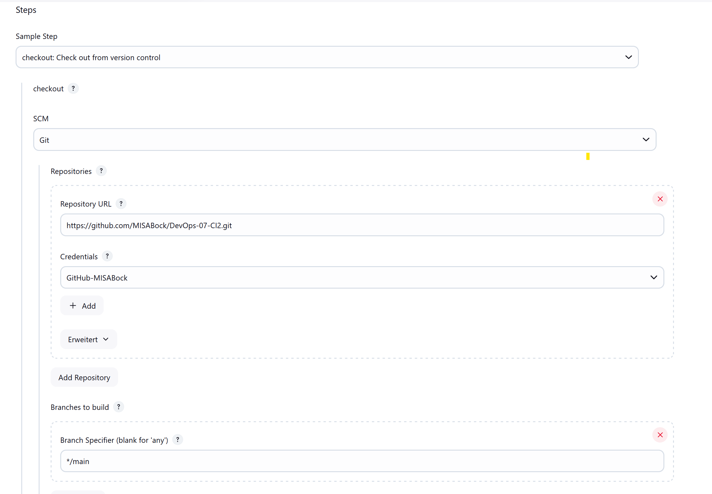)

Mit einem Build dann geprüft ob alles funktioniert soweit: (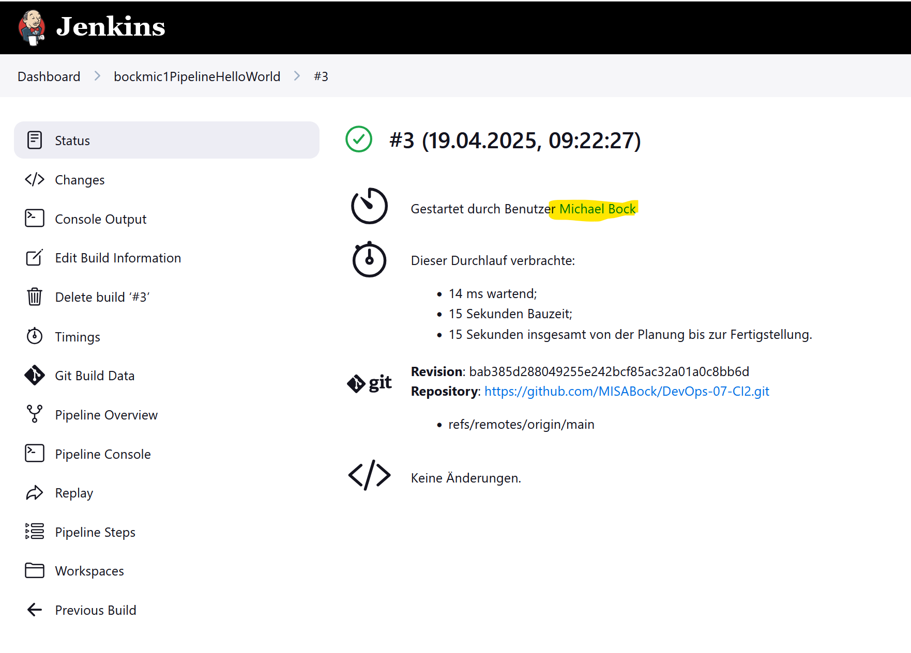)

Als nächstes habe ich eine neue Cloud erstellt: (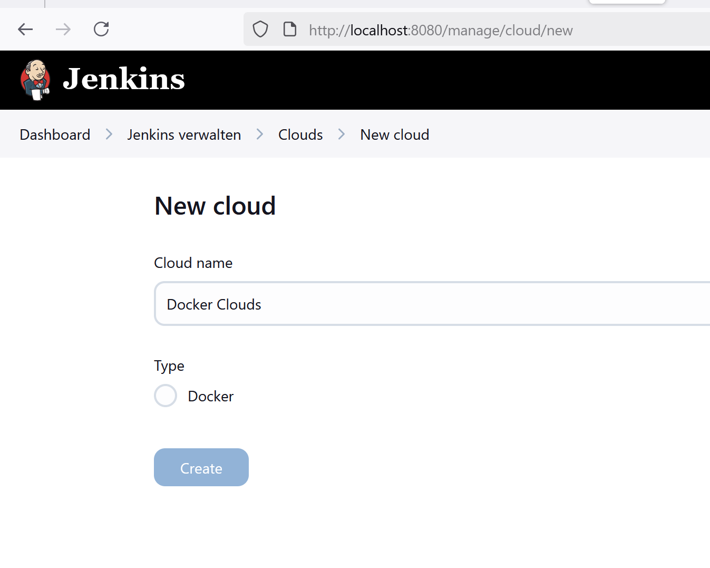) (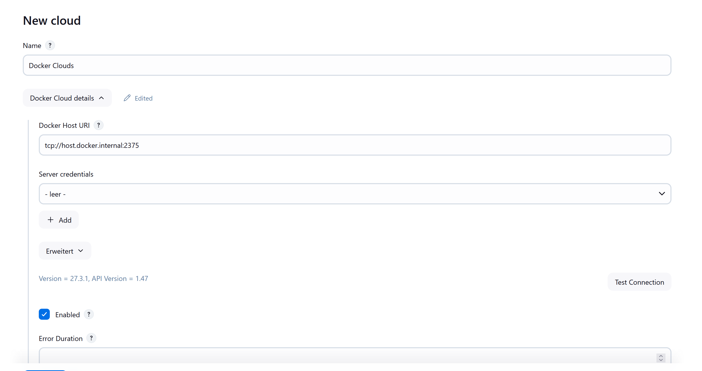)

Auf folgenden Logs sieht man, dass die Applikation auf der Jenkins Cloud läuft: (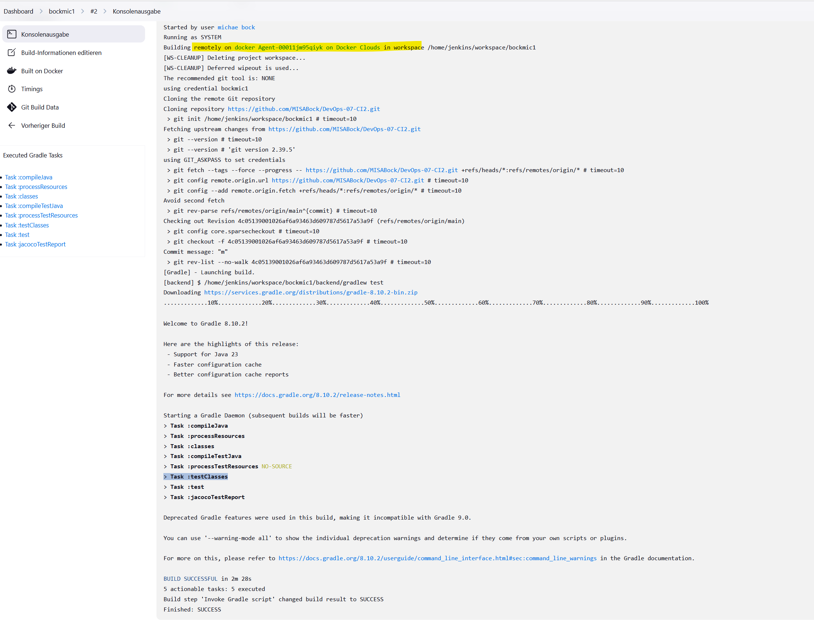 

Auch hier bei der Pipelien sieht man, dass Jenkins erfolgreich ein Docker Agent mit dem Image jenkins/agent:jdk21 gestartet und verbunden hat. Gleichzeitig sieht man, dass die Verbindung zum meinem Repo funktioniert.  (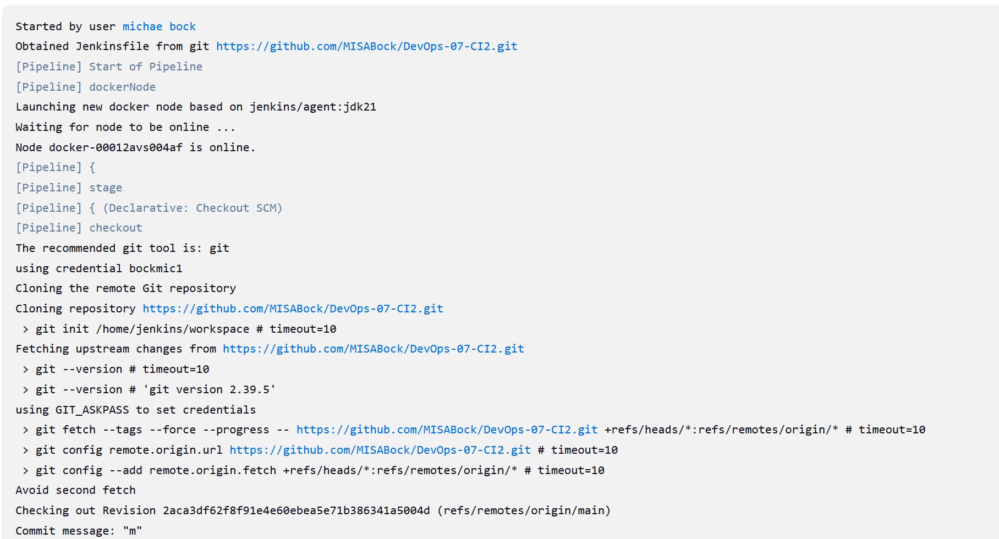)

Desweiteren musste ich den Token von Sonar in die Umgebung eingeben damit das frontend und backend laufen kann. (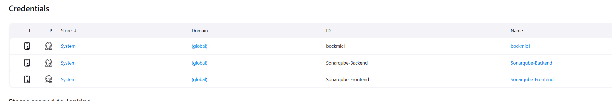

auf folgendem Screenshot sieht man wie das Gradle erfolgreich über die Pipeline gebaut wurde: (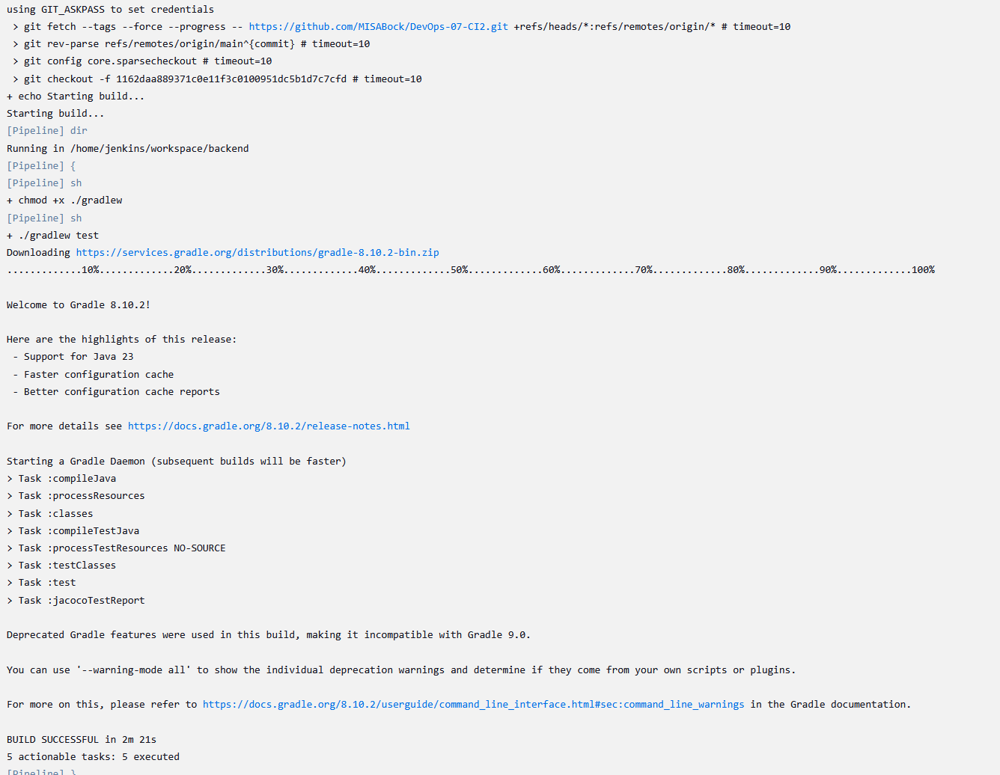)

auf folgendem Screenshot das Jacocoplugin und Bericht (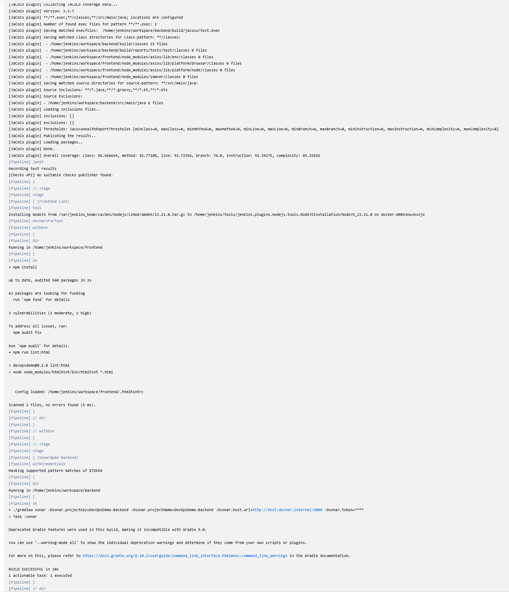)

Das selbe für das Frontend Linting  (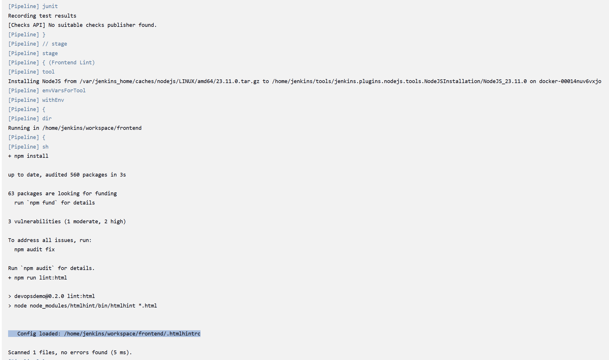)

Das Backend wurde auch richtig gestaret: () 
PipelineFrontedLogs
letztlich wurde auch das frontend erfolgreich gestartet: (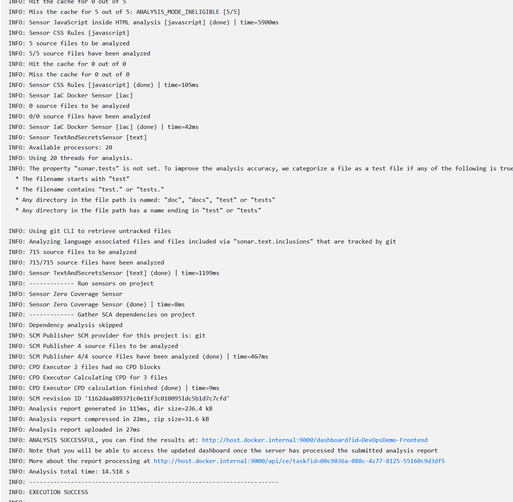) 
