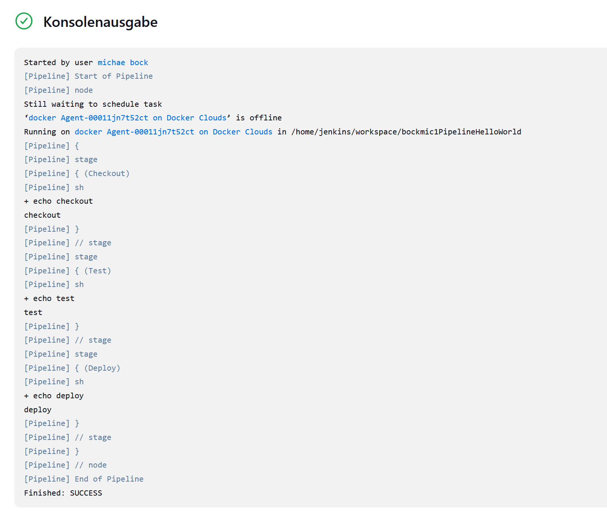

# DevOps 07 CI2

## Lernjournal

Als erstes habe ich den Shell-Befehle für Sonar Analyse ins CMD eingeben damit das Project auf Sonar verfügbar ist und analysiert wird. () ()

Das gleiche fürs Frontend: () ()

Als nächstes habe ich auf Jenkins eine Pipeline angelegt: () ()

Mit einem Build dann geprüft ob alles funktioniert soweit: ()

Als nächstes habe ich eine neue Cloud erstellt: () ()

Auf folgenden Logs sieht man, dass die Applikation auf der Jenkins Cloud läuft: ( (