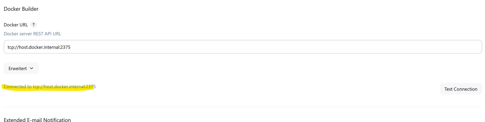

# DevOps 08 Docker

## Lernjournal

Als erstes habe ich die Repo geändert und das Docker build step Plugin installiert 

()

Als weiteres habe ich ein neues Freestyle-Projekt eröffnet mit Git Version Control 
 https://github.com/zhaw-iwi/DevOpsNodeWebApp

Als nächstes habe ich den Docker Builder konfiguriert und die Verbindung zum tcp 2375 geprüft:  ()

Desweiteren den Buildstep des Docker Images damit dieses erstellt wird: ()

Nachdem starten des Build-Prozesses auf Jenkins konnte ich übers cmd sehen, dass mein image erfolgreicch erstellt wurde: 
()

Ich habe im Projekt einen weiteren Build Step hinzugefügt damit von meinem soeben erstelltem Image bei starten des Jenkins-Prozess der Container gestartet wird: ()

Zusätzlich noch das Port-Binding definiert: ()

Um die Container ID des letzten Schrittes zu erfahren, habe ich noch folgendes Implementiert, damit mir die ContainerID beim build immer wieder gezeigt wird.  ()

Ich habe nochmals den container Namen angepasst und das so das Build konfiguriert, dass das Build auf einen Freien Platz auf Port 3000 warten soll: ()

letztlich habe ich dann noch definiert, dass zuerst das image gebaut werden soll und erst dannach der Job des Docker Deployement getriggered werden soll: ()

mit localhost:3001 habe ich dann geprüft, ob die App läuft: ()
()